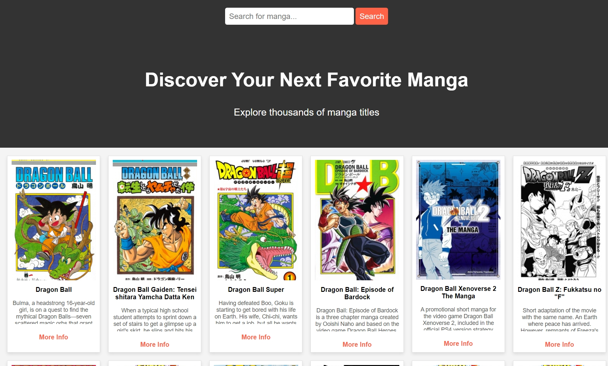

# Manga Search Web App

This project is a web application that allows users to search for manga titles using the Jikan API. It is built using Flask for the backend and HTML/CSS for the frontend.

## How It Works

### Backend (Flask)
The backend is implemented in Python using Flask. It handles requests, fetches data from the Jikan API, and passes it to the frontend.

#### `app.py` Explanation:

```python
from flask import Flask, render_template, request  # Import necessary modules
import requests  # Module to make API requests

app = Flask(__name__)  # Create Flask app instance

# Route to display the home page with manga list
@app.route('/')
def index():
    response = requests.get('https://api.jikan.moe/v4/manga')  # Fetch manga data from Jikan API
    manga_data = response.json()['data']  # Extract the 'data' key containing manga list
    return render_template('index.html', manga_data=manga_data)  # Render template and pass data

# Route for searching manga
@app.route('/search', methods=['GET'])
def search():
    query = request.args.get('query')  # Get search query from URL parameters
    if query:
        response = requests.get(f'https://api.jikan.moe/v4/manga?q={query}')  # Search API request
        manga_data = response.json()['data']  # Extract search results
    else:
        manga_data = []  # If no query, return empty list

    return render_template('index.html', manga_data=manga_data)  # Render template with results

if __name__ == "__main__":
    app.run(debug=True)  # Run Flask app in debug mode
```

### Explanation of the Backend Code
- **Flask Routes:**
  - The `/` route fetches and displays a list of manga.
  - The `/search` route processes user queries and fetches relevant manga from the API.
- **Conditional Statements (`if` and `else`):**
  - The search function checks if a query exists. If it does, it fetches data; otherwise, it returns an empty list.
- **Loops (`for` loop in Jinja2 - Template Engine):**
  - In `index.html`, a `for` loop iterates over the manga data and displays each manga.
- **Modules Used:**
  - `flask`: Web framework for handling routes and rendering templates.
  - `requests`: Fetches data from the Jikan API.

### Frontend (HTML & Jinja2 Templating)
The `index.html` file is responsible for rendering the UI and displaying the manga data dynamically.

#### `index.html` Explanation:
```html

    
    <div class="manga-card">
        
        <h3 class="manga-title">{{ manga.title }}</h3>
        <p class="manga-synopsis">{{ manga.synopsis[:200] if manga.synopsis else 'No synopsis available' }}...</p>
        <a href="{{ manga.url }}" target="_blank">More Info</a>
    </div>
    

    <p>No results found. Please try another search.</p>

```

### How the Backend and Frontend Work Together
1. The Flask app fetches manga data from the Jikan API.
2. The data is sent to `index.html` using `render_template()`.
3. Jinja2 templating in `index.html` dynamically renders the data.
4. When a user submits a search query, Flask processes it and fetches relevant results.
5. The updated results are displayed on the same page dynamically.

### Useful Links for Understanding Flask and Jinja2
- Flask Documentation: [https://flask.palletsprojects.com/](https://flask.palletsprojects.com/)
- Jinja2 Templating: [https://jinja.palletsprojects.com/](https://jinja.palletsprojects.com/)
- Requests Library: [https://docs.python-requests.org/en/latest/](https://docs.python-requests.org/en/latest/)
- Jikan API Documentation: [https://docs.api.jikan.moe/](https://docs.api.jikan.moe/)

### How to Run the Project
1. Install dependencies:
   ```sh
   pip install flask requests
   ```
2. Run the Flask app:
   ```sh
   python app.py
   ```
3. Open `http://127.0.0.1:5000/` in your web browser.

Now you can search for manga titles and explore them using the Jikan API!

